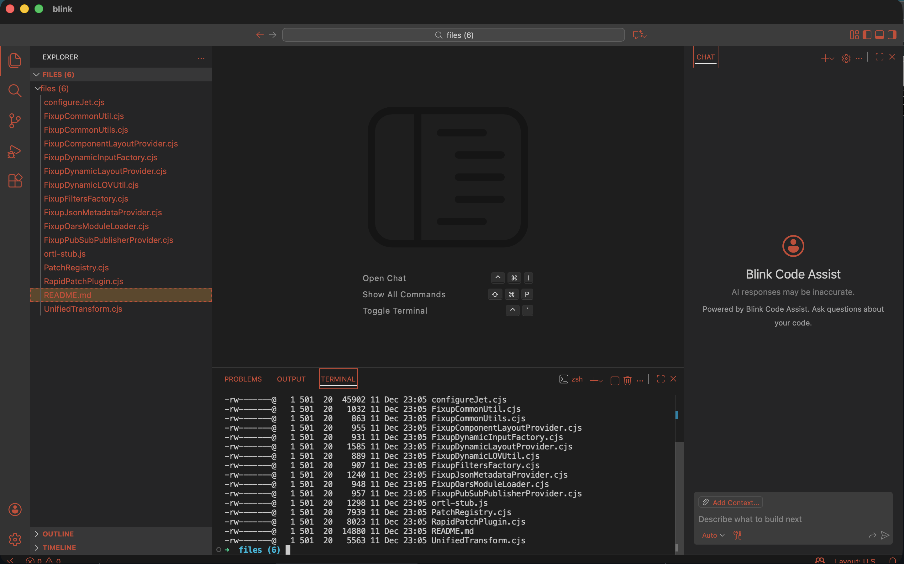
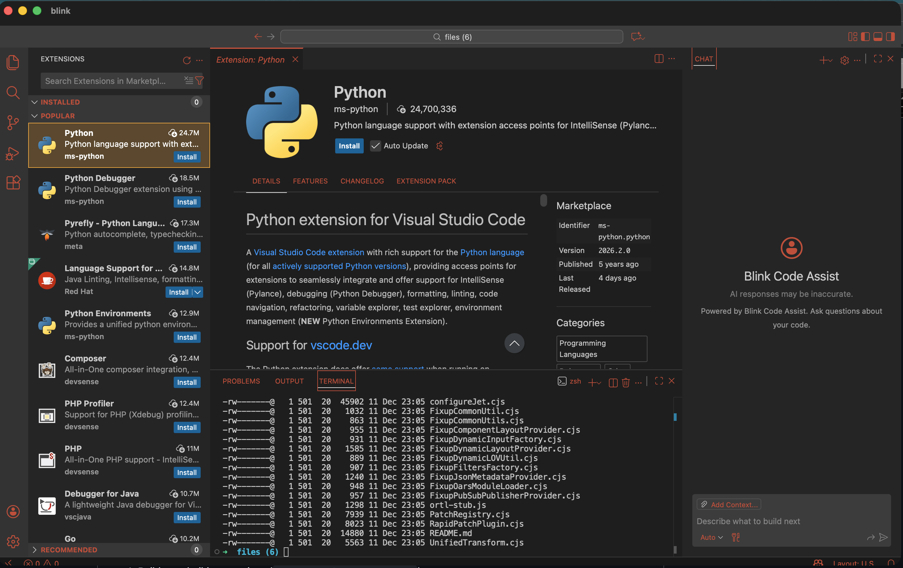

# Blink

## THIS IS CURRENTLY A PROOF OF CONCEPT ONLY, AND SUPER BUGGY

If you'd like to see more of this, let me know!

**Blink is a native desktop IDE built on the full VS Code workbench, with an AI coding assistant built in.**

It runs VS Code's actual editor engine (via [monaco-vscode-api](https://github.com/CodinGame/monaco-vscode-api)) inside a lightweight [Tauri](https://tauri.app) window. The result looks and works exactly like VS Code — file explorer, extensions marketplace, integrated terminal, IntelliSense, themes — with an AI chat panel alongside it.

---

## Screenshots



*File explorer, integrated terminal, and AI chat panel (Blink Code Assist) side by side.*



*Browse and install extensions directly from the Open VSX marketplace.*

---

## What it does

- **Full VS Code editor** — syntax highlighting, IntelliSense, go-to-definition, multi-cursor, themes, keybindings — the whole thing, not a Monaco snippet
- **Extensions marketplace** — install extensions from [Open VSX](https://open-vsx.org/) (Python, ESLint, Prettier, GitLens, etc.)
- **Integrated terminal** — real shell (zsh/bash) running via Tauri's native PTY
- **AI chat panel** — "Blink Code Assist" chat in the right-side auxiliary bar; supports `/plan`, `/agent`, `/compose`, `/run`, and other slash commands
- **Bring your own AI** — connect any AI provider via API key: Anthropic (Claude), OpenAI (GPT-4o), or any OpenAI-compatible endpoint (Ollama, etc.)
- **Native desktop app** — ships as a `.app` / `.dmg` on macOS; no browser, no Electron

---

## Configuring the AI provider

Open the Command Palette (`Cmd+Shift+P`) and run **Blink: Configure AI Provider**.

You'll be prompted to choose a provider and enter your API key:

| Provider | Models |
|----------|--------|
| Anthropic | `claude-opus-4-6`, `claude-sonnet-4-6`, etc. |
| OpenAI | `gpt-4o`, `gpt-4o-mini`, etc. |
| Custom (OpenAI-compatible) | Any local or hosted endpoint, e.g. Ollama |

Configuration is stored locally in `localStorage` — no account or login required.

---

## Stack

| Layer | Technology |
|-------|-----------|
| Desktop shell | [Tauri 2](https://tauri.app) (Rust) |
| Frontend | React 19 + Vite 6 |
| Editor | [monaco-vscode-api](https://github.com/CodinGame/monaco-vscode-api) v24 (full VS Code workbench) |
| Styling | Plain CSS with custom properties |
| AI | Pluggable API-key provider (Anthropic / OpenAI / custom) |

---

## Prerequisites

- **Node.js** ≥ 18
- **Rust** + `cargo` (latest stable) — needed for Tauri
- macOS: Xcode Command Line Tools (`xcode-select --install`)

---

## Quick start

```bash
# 1. Install dependencies
npm install

# 2. Start the full dev environment (Vite + Tauri)
npm run tauri:dev
```

`tauri:dev` runs `scripts/dev.sh`, which:
1. Builds any builtin extensions (`scripts/build-extensions.sh`)
2. Copies VS Code webview shim files to `public/`
3. Starts the Vite dev server on **port 1420** in the background
4. Waits until `http://localhost:1420` responds
5. Runs `cargo run` inside `src-tauri/` (first Rust compile is slow — ~5 min; subsequent runs are fast)

The Tauri window opens automatically once compiled.

### Vite only (browser preview, no Tauri)

```bash
npm run dev
# open http://localhost:1420
```

---

## Build

```bash
# Frontend only (outputs to web/)
npm run build

# Production Tauri bundle (.app / .dmg)
npm run tauri:build
```

---

## How it works

### Architecture overview

```
index.html
  └── src/main.tsx
        ├── [FIRST] services/vscode/workerSetupEntry   ← must be first import
        └── <App />
              ├── <SplashScreen />   (dismissed after ~2 s)
              └── <VSCodeWorkbench />
                    └── services/vscode/workbench.ts   (initializes VS Code)
```

**`workerSetupEntry` must be the very first import** in `main.tsx`. It injects a synthetic `process` object into the global scope before any `@codingame/monaco-vscode-*` packages load — those packages check `process.env` at import time and will crash without it.

### VS Code / Monaco layer

`src/services/vscode/` contains ~50 TypeScript files that configure the full VS Code workbench via `@codingame/monaco-vscode-api`. This layer is framework-agnostic (no React dependency) and handles:

- Service overrides (filesystem, extensions, settings, themes, terminal, search, …)
- Extension host setup (local web worker + optional sidecar)
- Worker registration (TypeScript, JSON, HTML, CSS language servers)
- Workspace folder persistence (localStorage + Tauri file dialogs)
- Webview shims (`public/vs/workbench/contrib/webview/browser/pre/`) for extension detail panels

### AI layer

`src/services/vscode/ai/` provides the AI integration:

| File | Role |
|------|------|
| `aiProviderService.ts` | Config storage + SSE streaming (Anthropic & OpenAI wire formats) |
| `chatService.ts` | Thin service wrapper used by the chat agent |
| `chatProvider.ts` | Implements the `ModelProvider` interface for the registry |
| `configureProviderCommand.ts` | Registers the `blink.configureAIProvider` VS Code command |
| `modelProvider.ts` | Provider registry abstraction (swap providers at runtime) |
| `openaiProvider.ts` | Standalone OpenAI provider implementation |

The chat panel is registered as a VS Code chat agent (`aiChatAgent.ts`) in the auxiliary bar. It supports slash commands: `/plan`, `/agent`, `/compose`, `/apply`, `/run`, `/remember`, `/forget`, `/rules`.

### Tauri backend

The Rust layer (`src-tauri/`) provides:
- Native window + webview
- File system access (`@tauri-apps/plugin-fs`)
- Native file/folder dialogs (`@tauri-apps/plugin-dialog`)
- PTY-based terminal (`@tauri-apps/plugin-shell`)
- App updater (`@tauri-apps/plugin-updater`)

---

## Project structure

```
blink/
├── index.html                          # Vite entry HTML
├── vite.config.ts                      # Vite config (port 1420, web/ output)
├── src/
│   ├── main.tsx                        # React entry — mounts <App />
│   ├── components/
│   │   ├── app.tsx                     # Root: SplashScreen + VSCodeWorkbench
│   │   ├── common/                     # SplashScreen, BlinkLogo, LoadingSpinner
│   │   └── vscode/                     # VSCodeWorkbench component + CSS
│   ├── services/
│   │   ├── vscode/                     # VS Code integration (~50 files)
│   │   │   ├── ai/                     # AI provider layer
│   │   │   ├── workbench.ts            # Main workbench initializer
│   │   │   ├── aiChatAgent.ts          # Chat panel agent + slash commands
│   │   │   └── chatEntitlementService.ts  # Bypasses Copilot login UI
│   │   └── aiChat.ts                   # Legacy AI chat helper
│   └── styles/
│       └── app.css                     # Global styles + color palette
├── src-tauri/                          # Rust / Tauri backend
│   ├── src/                            # Rust source (commands, PTY, updater)
│   ├── tauri.conf.json                 # devUrl: :1420, frontendDist: ../web
│   └── resources/extensions/           # Packaged builtin extensions
├── extensions/builtin/                 # Extension source (built by esbuild)
├── extensions-web/builtin/             # Built extension JS (served by Vite)
├── public/
│   └── vs/workbench/contrib/webview/   # Webview shim files
├── docs/screenshots/                   # App screenshots
└── scripts/
    ├── dev.sh                          # tauri:dev entry point
    ├── build-extensions.sh             # Builds builtin extensions
    └── copy-webview-shims.sh           # Copies webview shims to public/
```

---

## Scripts reference

| Script | What it does |
|--------|-------------|
| `npm run dev` | Vite dev server on :1420 |
| `npm run build` | Vite production build → `web/` |
| `npm run tauri:dev` | Full dev: extensions → Vite → Tauri |
| `npm run tauri:build` | Production Tauri bundle |
| `npm run lint` | ESLint |
| `npm run format` | Prettier |

---

## Known issues / gotchas

- **First `cargo run` is slow** — Rust compiles ~300+ crates. Subsequent runs use incremental caching and are much faster.
- **Port 1420 must be free** — Vite uses `strictPort: true`. Kill anything on that port before starting.
- **`web/` must exist before Tauri opens** — Always use `npm run tauri:dev`; running `cargo run` directly without a prior build will show a blank window.
- **Monaco chunk is large** — The `monaco-vscode` bundle is ~10–20 MB unminified. Expected — it contains the entire VS Code platform.
